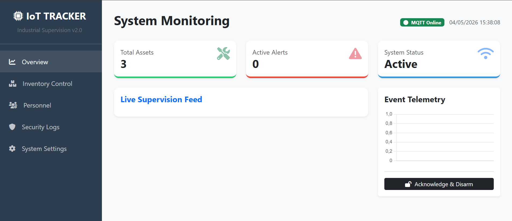

# Smart Asset IoT Tracker 🚀

**An Industrial IoT ecosystem for real-time asset tracking and security. Integrates ESP32 hardware, RFID authentication, and a Flask-SocketIO SCADA dashboard for smart monitoring.**



## 📖 Overview
This advanced IoT ecosystem is designed for school equipment tracking and industrial asset security. It features a professional web-based SCADA-style dashboard, real-time communication via MQTT/WebSockets, and hardware integration for physical security alerts.
- **Real-time Monitoring**: Live telemetry of asset movement using Chart.js.
- **RFID Authorization**: Secure access control linked to a SQLite database.
- **Security Alerts**: Immediate visual and acoustic (Buzzer) notification of unauthorized movements.
- **Industrial Dashboard**: Dedicated modules for Inventory Control, Personnel Management, and Security Auditing.
- **Event-Driven Architecture**: Decoupled communication using the MQTT protocol.

---

## 🛠️ Tech Stack
- **Hardware**: ESP32, RC522 RFID Reader, SW-420 Vibration Sensor, Active Buzzer.
- **Backend**: Python Flask, Flask-SocketIO.
- **Database**: SQLite3 (Relational).
- **Protocol**: MQTT (Broker: HiveMQ).
- **Frontend**: Bootstrap 5, FontAwesome, Chart.js.

---

## 📦 Installation & Setup

### 1. Software Prerequisites
Ensure you have **Python 3.x** installed. Then, install the required libraries:
```bash
pip install flask flask-socketio paho-mqtt eventlet
```

### 2. Database Initialization
Before running the server, initialize the SQLite database schema:
```bash
python init_db.py
```
*This script creates the tables for users, assets, and logs with professional seed data.*

### 3. Hardware Configuration (ESP32)
1. Open `hardware.ino` in the **Arduino IDE**.
2. Install the following libraries via the Library Manager:
   - `MFRC522` (by GithubCommunity)
   - `PubSubClient` (by Nick O'Leary)
3. Update the `ssid` and `password` variables with your WiFi credentials.
4. Upload the code to your ESP32 board.

---

## 🖥️ How to Run the Project

1. **Start the Flask Server**:
   ```bash
   python app.py
   ```
2. **Access the Dashboard**:
   Open your browser and navigate to:
   `http://localhost:5000`

3. **Operation**:
   - Scan an RFID tag: The dashboard will show the user's name and authorize access.
   - Trigger the vibration sensor: An "ALERT" status will flash red on the dashboard.
   - Click **"Acknowledge & Disarm"** to reset the security state.

---

## 📂 Project Structure
- `app.py`: The central Flask application handling MQTT and WebSockets.
- `init_db.py`: Database schema and initial data setup.
- `database.db`: SQLite file (generated after init).
- `templates/index.html`: The professional Single Page Application (SPA) dashboard.
- `hardware.ino`: C++ firmware for the ESP32 microcontroller.

---

## 🔍 Database Inspection
To view or modify the stored data manually:
1. Download **DB Browser for SQLite**.
2. Open the `database.db` file.
3. Browse the `logs` table to see the full audit trail of every scanned tag and detected vibration.

---
**Developed for Industrial Informatics Bachelor Thesis**
